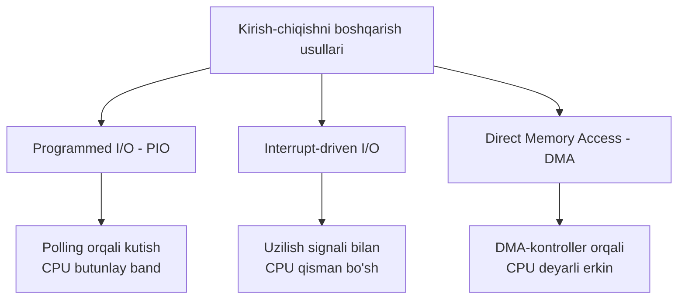
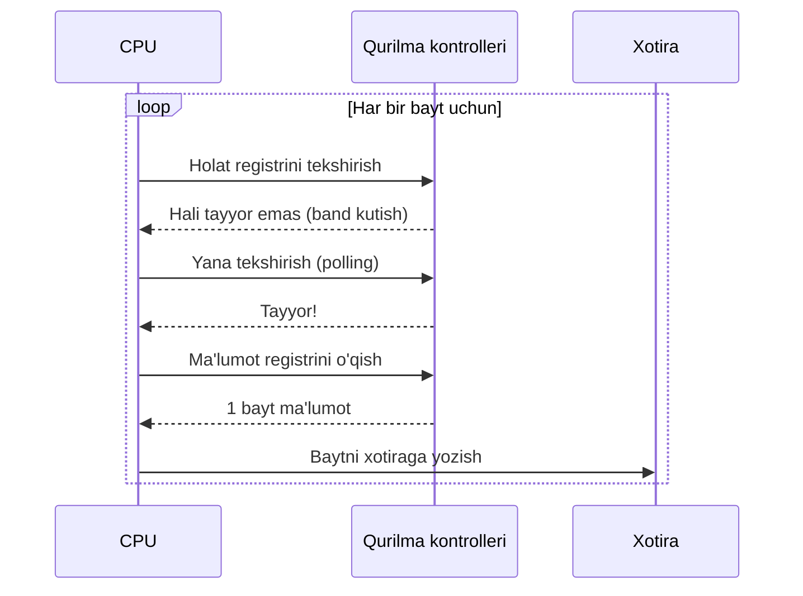
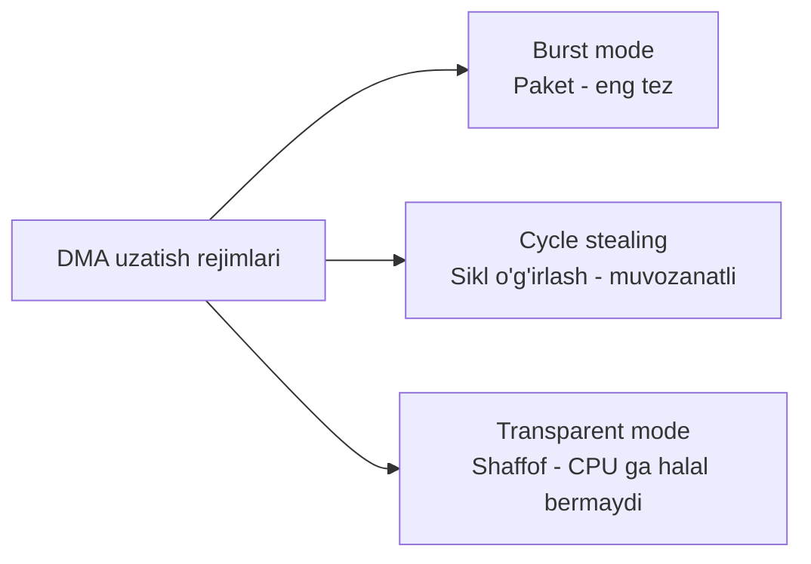
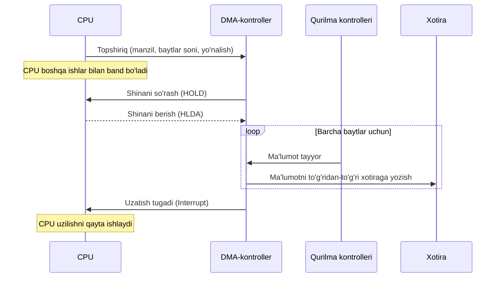
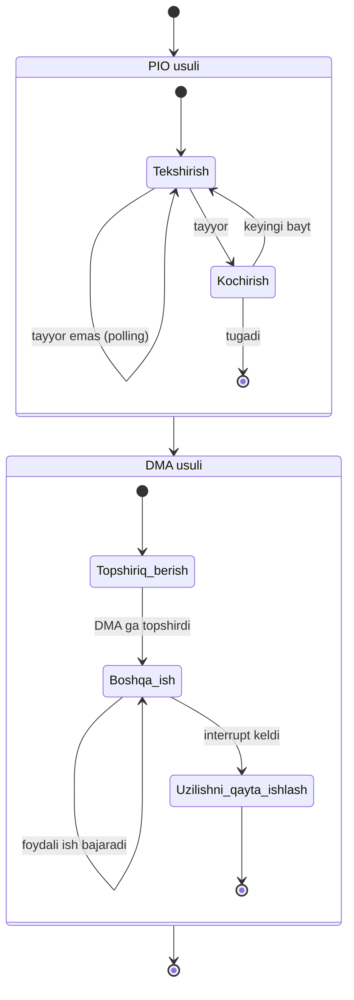

# MUSTAQIL ISH

---

## TITUL VARAQ

**O'ZBEKISTON RESPUBLIKASI**
**OLIY TA'LIM, FAN VA INNOVATSIYALAR VAZIRLIGI**

**\_\_\_\_\_\_\_\_\_\_\_\_\_\_\_\_\_\_\_\_\_\_\_\_\_\_\_\_\_\_\_\_\_ UNIVERSITETI**

**\_\_\_\_\_\_\_\_\_\_\_\_\_\_\_\_\_\_\_\_\_\_\_\_\_\_\_\_\_\_\_ fakulteti**

---

<br>

### MUSTAQIL ISH

**Fan:** Operatsion tizimlar

**Mavzu:** PIO (Programmed I/O) va DMA (Direct Memory Access) o'rtasidagi farqni modellashtirish (diagrammalar va tavsif)

<br>

| | |
|---|---|
| **Bajardi:** | \_\_\_\_\_\_\_\_\_\_\_\_\_\_\_\_\_\_\_\_\_\_ |
| **Guruh:** | \_\_\_\_\_\_\_\_\_\_\_\_\_\_\_\_\_\_\_\_\_\_ |
| **Qabul qildi:** | \_\_\_\_\_\_\_\_\_\_\_\_\_\_\_\_\_\_\_\_\_\_ |
| **Baho:** | \_\_\_\_\_\_\_\_\_\_\_\_\_\_\_\_\_\_\_\_\_\_ |

<br>

**\_\_\_\_\_\_\_\_\_\_\_\_\_\_\_\_\_\_ — 2026**

---

<div style="page-break-after: always;"></div>

## MUNDARIJA (REJA)

1. **Kirish** ............................................................................. 3
2. **I BOB. Kirish-chiqish (I/O) tizimlari haqida umumiy tushuncha**
   - 1.1. Kompyuterda ma'lumot almashinuvi va I/O qurilmalari .................... 4
   - 1.2. Protsessor, xotira va qurilmalar o'rtasidagi aloqa ...................... 5
   - 1.3. Kirish-chiqishni boshqarish usullarining tasnifi ....................... 6
3. **II BOB. PIO (Programmed Input/Output) — dasturiy boshqariladigan I/O**
   - 2.1. PIO tushunchasi va ishlash prinsipi .................................... 7
   - 2.2. So'rov (polling) va kutish mexanizmi .................................. 8
   - 2.3. PIO ning diagrammasi va modeli ........................................ 9
   - 2.4. PIO ning afzallik va kamchiliklari .................................... 10
4. **III BOB. DMA (Direct Memory Access) — to'g'ridan-to'g'ri xotiraga kirish**
   - 3.1. DMA tushunchasi va DMA-kontroller ..................................... 11
   - 3.2. DMA ning ishlash bosqichlari .......................................... 12
   - 3.3. DMA uzatish rejimlari (burst, cycle stealing, transparent) ............ 13
   - 3.4. DMA ning diagrammasi va modeli ........................................ 14
   - 3.5. DMA ning afzallik va kamchiliklari .................................... 15
5. **IV BOB. PIO va DMA ni modellashtirish va taqqoslash**
   - 4.1. Ikki usulning qiyosiy modeli .......................................... 16
   - 4.2. Taqqoslash jadvali ................................................... 17
   - 4.3. Unumdorlik (performance) tahlili va misol ............................. 18
   - 4.4. Qaysi holatda qaysi usul qo'llaniladi ................................ 19
6. **Xulosa** ............................................................................ 20
7. **Foydalanilgan adabiyotlar** .................................................. 20

---

<div style="page-break-after: always;"></div>

## KIRISH

Zamonaviy hisoblash texnikasining samaradorligi nafaqat markaziy protsessor (CPU) ning tezligiga, balki tashqi qurilmalar bilan ma'lumot almashinuvi qanchalik unumli tashkil etilganiga ham bog'liq. Disk, klaviatura, tarmoq adapteri, video karta va boshqa periferiya qurilmalari bilan protsessor o'rtasida doimiy ravishda katta hajmdagi ma'lumotlar oqimi harakatlanadi. Ushbu oqimni boshqarish — operatsion tizimlar va kompyuter arxitekturasining markaziy masalalaridan biridir.

Kirish-chiqish (Input/Output, I/O) amallarini tashkil etishning bir necha asosiy usullari mavjud bo'lib, ulardan eng ko'p o'rganiladigan ikkitasi — **PIO (Programmed Input/Output)** va **DMA (Direct Memory Access)** dir. Bu ikki usul kompyuterda ma'lumotni qurilmadan xotiraga (yoki aksincha) ko'chirishning printsipial jihatdan farqli yondashuvlarini ifodalaydi.

**PIO** usulida har bir baytni yoki so'zni ko'chirish bevosita protsessor tomonidan, dasturiy buyruqlar yordamida amalga oshiriladi. Bu protsessorni band qiladi va uning vaqtini "behuda" sarflaydi. **DMA** usulida esa ma'lumot uzatishni maxsus apparat — DMA-kontroller bajaradi, protsessor esa bu vaqtda boshqa foydali ishlar bilan band bo'la oladi.

Ushbu mustaqil ishning **maqsadi** — PIO va DMA usullarining ishlash prinsiplarini chuqur o'rganish, ularning o'rtasidagi farqni diagrammalar va sxemalar yordamida modellashtirish hamda qiyosiy tahlil qilishdan iborat.

Ishning **vazifalari**:
1. Kirish-chiqish tizimlarining umumiy tamoyillarini yoritish;
2. PIO usulining ishlash mexanizmini diagramma orqali tushuntirish;
3. DMA usulining ishlash bosqichlarini va kontroller rolini modellashtirish;
4. Ikki usulni qiyosiy jadval va sxemalar orqali taqqoslash;
5. Unumdorlik bo'yicha tahlil o'tkazish va amaliy tavsiyalar berish.

Ishning **dolzarbligi** shundaki, zamonaviy SSD disklar, yuqori tezlikdagi tarmoqlar va GPU-larda aynan DMA texnologiyasi keng qo'llaniladi, ammo PIO usuli ham oddiy va kam ma'lumotli amallarda hamon o'z ahamiyatini saqlab qolgan. Bu ikki usulni to'g'ri tushunish — samarali dasturiy ta'minot va apparat loyihalash uchun zaruriy bilimdir.

---

<div style="page-break-after: always;"></div>

## I BOB. KIRISH-CHIQISH (I/O) TIZIMLARI HAQIDA UMUMIY TUSHUNCHA

### 1.1. Kompyuterda ma'lumot almashinuvi va I/O qurilmalari

Kompyuter tizimi uch asosiy komponentdan tashkil topgan deb qaraladi:
- **Markaziy protsessor (CPU)** — buyruqlarni bajaradi va hisob-kitoblarni amalga oshiradi;
- **Asosiy xotira (RAM)** — bajarilayotgan dastur va ma'lumotlarni saqlaydi;
- **Kirish-chiqish qurilmalari (I/O devices)** — tashqi dunyo bilan aloqani ta'minlaydi.

Bu komponentlar **shina (bus)** orqali o'zaro bog'langan. Shina — manzil shinasi (address bus), ma'lumot shinasi (data bus) va boshqaruv shinasi (control bus) dan iborat.

Har bir I/O qurilma o'zining **qurilma kontrolleri (device controller)** ga ega bo'lib, unda quyidagi registrlar mavjud:
- **Ma'lumot registri (data register)** — uzatilayotgan baytni saqlaydi;
- **Holat registri (status register)** — qurilmaning hozirgi holatini (band, tayyor, xato) ko'rsatadi;
- **Boshqaruv registri (control register)** — qurilmaga buyruq beradi.

```
+-------------------+        Shina (Bus)        +-------------------+
|       CPU         |<------------------------->|    Xotira (RAM)   |
+-------------------+                           +-------------------+
         ^                                                ^
         |                  Tizim shinasi                 |
         v                                                v
+--------------------------------------------------------------------+
|                        Boshqaruv shinasi                           |
+--------------------------------------------------------------------+
         |                      |                       |
         v                      v                       v
+----------------+   +----------------+      +----------------------+
| Disk kontroller|   | Klaviatura k.  |      | Tarmoq adapteri      |
+----------------+   +----------------+      +----------------------+
         |                      |                       |
         v                      v                       v
   [Qattiq disk]          [Klaviatura]            [Tarmoq / Internet]
```
*1.1-rasm. Kompyuter tizimining umumiy tuzilmasi va I/O qurilmalari.*

### 1.2. Protsessor, xotira va qurilmalar o'rtasidagi aloqa

I/O qurilmalari protsessorga nisbatan ancha sekin ishlaydi. Masalan, protsessor nanosaniyalarda buyruq bajaradi, qattiq disk esa millisaniyalar talab qiladi — bu farq million martagacha yetishi mumkin. Shu sababli protsessor va qurilma o'rtasida **tezlik nomutanosibligi (speed mismatch)** muammosi yuzaga keladi.

Bu muammoni hal qilish uchun bir necha mexanizmlar ishlab chiqilgan:
1. **Polling (so'rov)** — protsessor qurilma holatini takror-takror tekshiradi;
2. **Interrupt (uzilish)** — qurilma tayyor bo'lganda protsessorga signal yuboradi;
3. **DMA (to'g'ridan-to'g'ri kirish)** — ma'lumot protsessorni chetlab xotiraga ko'chiriladi.

### 1.3. Kirish-chiqishni boshqarish usullarining tasnifi

I/O ni boshqarish uch asosiy usulga bo'linadi:


*1.2-rasm. I/O boshqaruv usullarining tasnifi.*

Ushbu mustaqil ishda asosiy e'tibor **PIO** va **DMA** usullariga qaratiladi, chunki ular ma'lumot uzatish jarayonida protsessor rolining ikki qarama-qarshi yondashuvini ifodalaydi.

---

<div style="page-break-after: always;"></div>

## II BOB. PIO (PROGRAMMED INPUT/OUTPUT) — DASTURIY BOSHQARILADIGAN I/O

### 2.1. PIO tushunchasi va ishlash prinsipi

**Programmed I/O (PIO)** — bu ma'lumotni qurilma va xotira o'rtasida ko'chirishning eng oddiy va eng eski usuli bo'lib, unda **butun jarayonni markaziy protsessor (CPU) o'zi bajaradi**. Ya'ni har bir bayt yoki so'z protsessor registri orqali o'tadi: avval qurilmadan protsessor registriga, so'ngra registrdan xotiraga (yoki teskari yo'nalishda).

PIO ning asosiy g'oyasi shundaki, protsessor maxsus mashina buyruqlari (masalan, `IN` va `OUT`) yordamida qurilma kontrolleridagi registrlar bilan to'g'ridan-to'g'ri ishlaydi.

PIO da ma'lumot uzatishning umumiy ketma-ketligi:
1. CPU qurilma **holat registrini** o'qiydi;
2. Agar qurilma **tayyor** bo'lmasa, CPU qayta-qayta tekshiradi (polling);
3. Qurilma **tayyor** bo'lganda, CPU bir bayt ma'lumotni o'qiydi yoki yozadi;
4. CPU ma'lumotni xotiraga ko'chiradi;
5. Hisoblagichni kamaytiradi va keyingi baytga o'tadi;
6. Barcha baytlar uzatilguncha jarayon takrorlanadi.

### 2.2. So'rov (polling) va kutish mexanizmi

PIO ning eng muhim xususiyati — **polling (so'rov)** mexanizmidir. Protsessor qurilmaning tayyorligini bilish uchun holat registrini doimiy aylanma (loop) ichida tekshiradi. Bu jarayon "**band kutish (busy waiting)**" deb ataladi, chunki protsessor hech qanday foydali ish qilmasdan, faqat kutib turadi.

Quyidagi soddalashtirilgan psevdokod PIO orqali ma'lumot o'qishni ko'rsatadi:

```
// PIO orqali N bayt o'qish (psevdokod)
for (i = 0; i < N; i++) {
    // 1-bosqich: qurilma tayyor bo'lguncha kutish (busy wait)
    while (status_register != READY) {
        ;   // hech narsa qilmasdan tekshiraveramiz (polling)
    }
    // 2-bosqich: ma'lumotni qurilmadan o'qish
    data = read(data_register);
    // 3-bosqich: ma'lumotni xotiraga yozish
    memory[buffer + i] = data;
}
```
*2.1-listing. PIO orqali ma'lumot o'qish algoritmi.*

Bu yerda `while` aylanmasi — aynan o'sha "band kutish" bo'lib, protsessor vaqtini eng ko'p sarflaydigan qism hisoblanadi.

### 2.3. PIO ning diagrammasi va modeli

PIO da ma'lumotning harakat yo'li **qurilma → CPU → xotira** ko'rinishida bo'ladi. Ya'ni har bir bayt majburan protsessor orqali o'tadi.

```
        +-------------------------------------------------+
        |                      CPU                        |
        |   +-----------+         +-----------------+     |
        |   | Registr   |<------->| Boshqaruv mantiq|     |
        |   +-----------+         +-----------------+     |
        +--------^------------------------+---------------+
                 |                        |
        (1) o'qish|                       |(2) yozish
                 |                        v
        +----------------+        +----------------+
        | Qurilma        |        | Xotira (RAM)   |
        | kontrolleri    |        |                |
        +----------------+        +----------------+
                 ^
                 |
            [Tashqi qurilma]

  Ma'lumot yo'li:  QURILMA --> CPU REGISTRI --> XOTIRA
  (har bir bayt majburan CPU orqali o'tadi)
```
*2.2-rasm. PIO da ma'lumotning harakat yo'li.*

Quyidagi ketma-ketlik diagrammasi (sequence diagram) PIO jarayonini vaqt bo'yicha ko'rsatadi:


*2.3-rasm. PIO jarayonining ketma-ketlik diagrammasi.*

### 2.4. PIO ning afzallik va kamchiliklari

**Afzalliklari:**
- **Soddaligi** — qo'shimcha apparat (DMA-kontroller) talab qilmaydi;
- **Arzonligi** — apparat jihatdan eng kam xarajat talab etadi;
- **Kichik ma'lumotlar uchun samaradorlik** — bir-ikki bayt uzatishda ortiqcha tashkiliy xarajat (overhead) bo'lmaydi;
- **To'liq nazorat** — protsessor butun jarayonni boshqaradi, sinxronlash oson.

**Kamchiliklari:**
- **Protsessor vaqtini behuda sarflash** — band kutish (busy waiting) tufayli CPU foydali ish qila olmaydi;
- **Past unumdorlik** — katta hajmli ma'lumotlarda juda sekin;
- **Tizimning umumiy samaradorligi pasayadi** — CPU boshqa vazifalarni bajara olmaydi;
- **Energiya isrofi** — protsessor doimiy band turadi.

---

<div style="page-break-after: always;"></div>

## III BOB. DMA (DIRECT MEMORY ACCESS) — TO'G'RIDAN-TO'G'RI XOTIRAGA KIRISH

### 3.1. DMA tushunchasi va DMA-kontroller

**Direct Memory Access (DMA)** — bu ma'lumotni qurilma va asosiy xotira o'rtasida **protsessorni chetlab o'tib**, to'g'ridan-to'g'ri ko'chirish texnologiyasidir. Bu vazifani maxsus apparat — **DMA-kontroller (DMAC)** bajaradi.

DMA-kontroller protsessor o'rniga shinani boshqarib, ma'lumotni qurilmadan xotiraga (yoki aksincha) mustaqil ravishda uzatadi. Protsessor faqat **boshlanishida** topshiriq beradi va **tugaganida** uzilish (interrupt) signali oladi.

DMA-kontrollerning asosiy registrlari:
- **Manzil registri (address register)** — xotirada ma'lumot joylashadigan boshlang'ich manzil;
- **Hisoblagich registri (count register)** — uzatiladigan baytlar soni;
- **Boshqaruv registri (control register)** — uzatish yo'nalishi (o'qish/yozish) va rejimi;
- **Holat registri (status register)** — uzatish holati.

### 3.2. DMA ning ishlash bosqichlari

DMA orqali ma'lumot uzatish quyidagi bosqichlarda amalga oshiriladi:

1. **Tayyorlash (initialization):** CPU DMA-kontrollerga quyidagilarni beradi:
   - xotira manzili (qayerga yozish/qayerdan o'qish);
   - baytlar soni;
   - uzatish yo'nalishi;
2. **Shinani so'rash (bus request):** DMA-kontroller protsessordan shinadan foydalanish huquqini so'raydi (HOLD signali);
3. **Shinani berish (bus grant):** CPU shinani DMA-kontrollerga beradi (HLDA signali);
4. **Ma'lumot uzatish (transfer):** DMA-kontroller ma'lumotni to'g'ridan-to'g'ri qurilma va xotira o'rtasida ko'chiradi;
5. **Tugatish (completion):** barcha baytlar uzatilgach, DMA-kontroller protsessorga **uzilish (interrupt)** signalini yuboradi;
6. **Qayta ishlash:** CPU uzilishni qayta ishlaydi va natijani tekshiradi.

### 3.3. DMA uzatish rejimlari

DMA-kontroller shinadan foydalanishning uchta asosiy rejimi mavjud:

| Rejim | Tavsif | Xususiyati |
|-------|--------|-----------|
| **Burst mode (paket rejimi)** | DMA butun blokni bir yo'la uzatadi, shina to'liq band qilinadi | Eng tez, lekin CPU uzoq vaqt bloklanadi |
| **Cycle stealing (sikl o'g'irlash)** | DMA bitta sikl davomida bitta bayt uzatadi, so'ng shinani CPU ga qaytaradi | CPU va DMA navbatma-navbat ishlaydi |
| **Transparent mode (shaffof rejim)** | DMA faqat CPU shinani ishlatmayotgan paytda uzatadi | CPU ga umuman halal bermaydi, lekin sekin |


*3.1-rasm. DMA uzatish rejimlari.*

### 3.4. DMA ning diagrammasi va modeli

DMA da ma'lumotning harakat yo'li **qurilma ↔ xotira** ko'rinishida bo'lib, protsessor bu yo'lda ishtirok etmaydi:

```
        +-------------------+
        |       CPU         |  (boshqa ishlar bilan band)
        +---------^---------+
                  |
       (1) topshiriq |       (5) uzilish (interrupt)
                  |  ^
                  v  |
        +-------------------+        Ma'lumot to'g'ridan-to'g'ri
        |  DMA-kontroller   |        QURILMA <--> XOTIRA
        +---------+---------+
                  |
       +----------+-----------+
       |                      |
       v                      v
+----------------+    +----------------+
| Qurilma        |===>| Xotira (RAM)   |
| kontrolleri    |<===|                |
+----------------+    +----------------+
        ^
        |
   [Tashqi qurilma]

  Ma'lumot yo'li:  QURILMA <==> XOTIRA  (CPU ni chetlab o'tadi)
```
*3.2-rasm. DMA da ma'lumotning harakat yo'li.*

Quyidagi ketma-ketlik diagrammasi DMA jarayonini ko'rsatadi:


*3.3-rasm. DMA jarayonining ketma-ketlik diagrammasi.*

### 3.5. DMA ning afzallik va kamchiliklari

**Afzalliklari:**
- **Protsessorni bo'shatadi** — CPU ma'lumot uzatish vaqtida boshqa vazifalarni bajaradi;
- **Yuqori unumdorlik** — katta hajmli ma'lumotlarni tez uzatadi;
- **Tizim samaradorligini oshiradi** — parallel ishlashga imkon beradi;
- **Energiya tejamkorligi** — protsessor band kutishda turmaydi.

**Kamchiliklari:**
- **Apparat murakkabligi** — qo'shimcha DMA-kontroller talab etadi;
- **Narxi yuqoriroq** — qo'shimcha apparat xarajati;
- **Shina ziddiyati (bus contention)** — DMA va CPU bir vaqtda shinaga ehtiyoj sezganda;
- **Kesh (cache) muvofiqligi muammosi** — xotira to'g'ridan-to'g'ri o'zgartirilganda kesh eskirib qolishi mumkin;
- **Kichik ma'lumotlar uchun samarasiz** — tashkiliy xarajat (overhead) katta bo'ladi.

---

<div style="page-break-after: always;"></div>

## IV BOB. PIO VA DMA NI MODELLASHTIRISH VA TAQQOSLASH

### 4.1. Ikki usulning qiyosiy modeli

PIO va DMA o'rtasidagi tub farq — **ma'lumotning harakat yo'li** va **protsessorning roli**dadir. Quyidagi qiyosiy diagramma ikkala usulni yonma-yon ko'rsatadi:

```
==================== PIO (Programmed I/O) ====================

   [Qurilma] ---> [ CPU registri ] ---> [ Xotira ]
                       (har bir bayt)
   CPU holati:  BAND (band kutish + ko'chirish)
   ----------------------------------------------------------
   Vaqt:  |--CPU--|--CPU--|--CPU--|--CPU--|--CPU--|  (to'liq band)


==================== DMA (Direct Memory Access) ==============

   [Qurilma] <=========================> [ Xotira ]
                  (DMA-kontroller orqali)
              CPU bu yo'lda ishtirok etmaydi
   CPU holati:  ERKIN (boshqa vazifalarni bajaradi)
   ----------------------------------------------------------
   Vaqt:  |--topshiriq--|...CPU boshqa ish bajaradi...|--uzilish--|
                         (DMA uzatadi)
```
*4.1-rasm. PIO va DMA da ma'lumot yo'li va CPU holatining qiyosi.*

Holat diagrammasi (state diagram) orqali CPU ning ikki usuldagi holatlari:


*4.2-rasm. CPU holatlari: PIO da doimiy band, DMA da erkin.*

### 4.2. Taqqoslash jadvali

| № | Mezon | PIO (Programmed I/O) | DMA (Direct Memory Access) |
|---|-------|----------------------|----------------------------|
| 1 | **Ma'lumot yo'li** | Qurilma → CPU → Xotira | Qurilma ↔ Xotira (to'g'ridan-to'g'ri) |
| 2 | **CPU ning roli** | Har bir baytni o'zi ko'chiradi | Faqat boshlaydi va tugashini kutadi |
| 3 | **CPU bandligi** | To'liq band (busy waiting) | Deyarli erkin |
| 4 | **Qo'shimcha apparat** | Kerak emas | DMA-kontroller kerak |
| 5 | **Tezlik** | Sekin | Tez |
| 6 | **Apparat narxi** | Arzon | Qimmatroq |
| 7 | **Murakkablik** | Oddiy | Murakkab |
| 8 | **Katta ma'lumot uchun** | Samarasiz | Juda samarali |
| 9 | **Kichik ma'lumot uchun** | Samarali | Overhead katta, samarasiz |
| 10 | **Uzilish ishlatilishi** | Shart emas (yoki har baytda) | Faqat oxirida (bir marta) |
| 11 | **Energiya sarfi** | Yuqori | Past |
| 12 | **Parallel ishlash** | Yo'q | Bor (CPU + DMA) |
| 13 | **Misol qurilmalar** | Klaviatura, sichqoncha, sensorlar | Disk, SSD, tarmoq, GPU, audio |

*4.1-jadval. PIO va DMA ning to'liq qiyosiy tahlili.*

### 4.3. Unumdorlik (performance) tahlili va misol

Faraz qilaylik, biz **4 KB (4096 bayt)** ma'lumotni diskdan xotiraga ko'chirmoqchimiz.

**PIO holatida:**
- Har bir bayt uchun CPU: holatni tekshirish + o'qish + yozish = taxminan 3-4 ta amal;
- 4096 bayt × 4 amal = **~16 384 ta CPU amali**;
- Bu vaqt davomida CPU **boshqa hech narsa qila olmaydi**.

**DMA holatida:**
- CPU faqat 1 marta topshiriq beradi (~5-10 amal);
- DMA-kontroller 4096 baytni mustaqil ko'chiradi;
- CPU bu vaqtda **boshqa 16 000+ amalni boshqa vazifalarga sarflashi mumkin**;
- Oxirida 1 ta uzilish qayta ishlanadi.

```
Unumdorlik taqqosi (4 KB uzatish):

PIO:  CPU yuki  ##########################  (100% band)
      Foydali ish: 0%

DMA:  CPU yuki   ##  (faqat boshlash va tugatish)
      Foydali ish: ~95% (boshqa vazifalarga)
```
*4.3-rasm. 4 KB ma'lumot uzatishda CPU yukining qiyosi.*

Bu misoldan ko'rinadiki, ma'lumot hajmi qancha katta bo'lsa, DMA ning afzalligi shuncha sezilarli bo'ladi. Kichik (1-2 bayt) ma'lumotlarda esa PIO afzalroq, chunki DMA ni sozlash uchun ketadigan vaqt (overhead) ma'lumotni uzatishdan ko'proq bo'lib qoladi.

### 4.4. Qaysi holatda qaysi usul qo'llaniladi

**PIO qo'llaniladigan holatlar:**
- Kam ma'lumotli, kam sonli qurilmalar (klaviatura, sichqoncha, oddiy sensorlar);
- Embedded (o'rnatilgan) tizimlarda, oddiy mikrokontrollerlarda;
- DMA-kontroller mavjud bo'lmagan arzon tizimlarda;
- Disk yuklash (boot) jarayonining dastlabki bosqichlarida.

**DMA qo'llaniladigan holatlar:**
- Katta hajmli ma'lumot uzatish (disk, SSD, fayl tizimi);
- Yuqori tezlikdagi tarmoq adapterlari (Ethernet, Wi-Fi);
- Grafik kartalar (GPU) va video oqimlar;
- Audio qurilmalari (uzluksiz oqim talab qiladi);
- Real vaqt (real-time) tizimlari.

---

<div style="page-break-after: always;"></div>

## XULOSA

Ushbu mustaqil ishda kompyuter tizimlarida kirish-chiqish amallarini boshqarishning ikki muhim usuli — **PIO (Programmed I/O)** va **DMA (Direct Memory Access)** batafsil o'rganildi, diagrammalar va sxemalar yordamida modellashtirildi hamda qiyosiy tahlil qilindi.

Ish davomida quyidagi asosiy **xulosalar** olindi:

1. **PIO usulida** ma'lumotning har bir bayti majburan markaziy protsessor orqali o'tadi. Bu protsessorni "band kutish (busy waiting)" holatiga olib keladi va uning vaqtini behuda sarflaydi. PIO sodda va arzon, ammo katta hajmli ma'lumotlar uchun samarasizdir.

2. **DMA usulida** ma'lumot maxsus DMA-kontroller yordamida qurilma va xotira o'rtasida to'g'ridan-to'g'ri, protsessorni chetlab ko'chiriladi. Protsessor faqat jarayonni boshlaydi va tugaganida uzilish signalini oladi. Bu yuqori unumdorlik va parallel ishlashni ta'minlaydi.

3. **Asosiy farq** — PIO da CPU "ishchi" rolida bo'lsa, DMA da u "boshqaruvchi" rolida bo'ladi. PIO da ma'lumot yo'li uch bosqichli (qurilma → CPU → xotira), DMA da esa to'g'ridan-to'g'ri (qurilma ↔ xotira).

4. **Tanlov mezoni** — kichik va kam sonli ma'lumotlar uchun PIO afzal, katta hajmli va tezkor ma'lumotlar uchun esa DMA afzaldir. Zamonaviy tizimlarda (SSD, GPU, tarmoq) aynan DMA ustunlik qiladi.

Demak, PIO va DMA bir-birini inkor etmaydigan, balki turli vaziyatlarda bir-birini to'ldiruvchi usullardir. Samarali kompyuter tizimini loyihalashda har bir usulning kuchli va kuchsiz tomonlarini hisobga olgan holda to'g'ri tanlov qilish muhimdir. Diagrammalar orqali modellashtirish esa bu ikki usulning tub farqini aniq va tushunarli ko'rsatib berdi.

---

## FOYDALANILGAN ADABIYOTLAR

1. Silberschatz A., Galvin P.B., Gagne G. **Operating System Concepts** (10th Edition). — Wiley, 2018.
2. Tanenbaum A.S., Bos H. **Modern Operating Systems** (4th Edition). — Pearson, 2015.
3. Stallings W. **Operating Systems: Internals and Design Principles** (9th Edition). — Pearson, 2018.
4. Patterson D.A., Hennessy J.L. **Computer Organization and Design** (5th Edition). — Morgan Kaufmann, 2014.
5. Hamacher C., Vranesic Z., Zaky S. **Computer Organization and Embedded Systems** (6th Edition). — McGraw-Hill, 2012.
6. Null L., Lobur J. **The Essentials of Computer Organization and Architecture** (5th Edition). — Jones & Bartlett Learning, 2018.
7. Mano M.M. **Computer System Architecture** (3rd Edition). — Pearson, 2007.

---

*Mustaqil ish · Fan: Operatsion tizimlar · Mavzu: PIO va DMA · 2026-yil*
