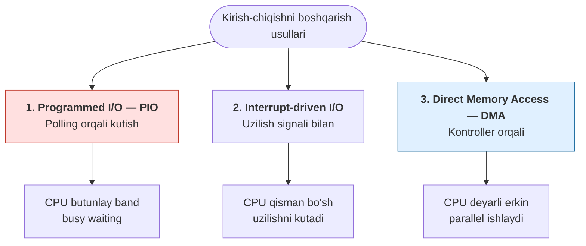
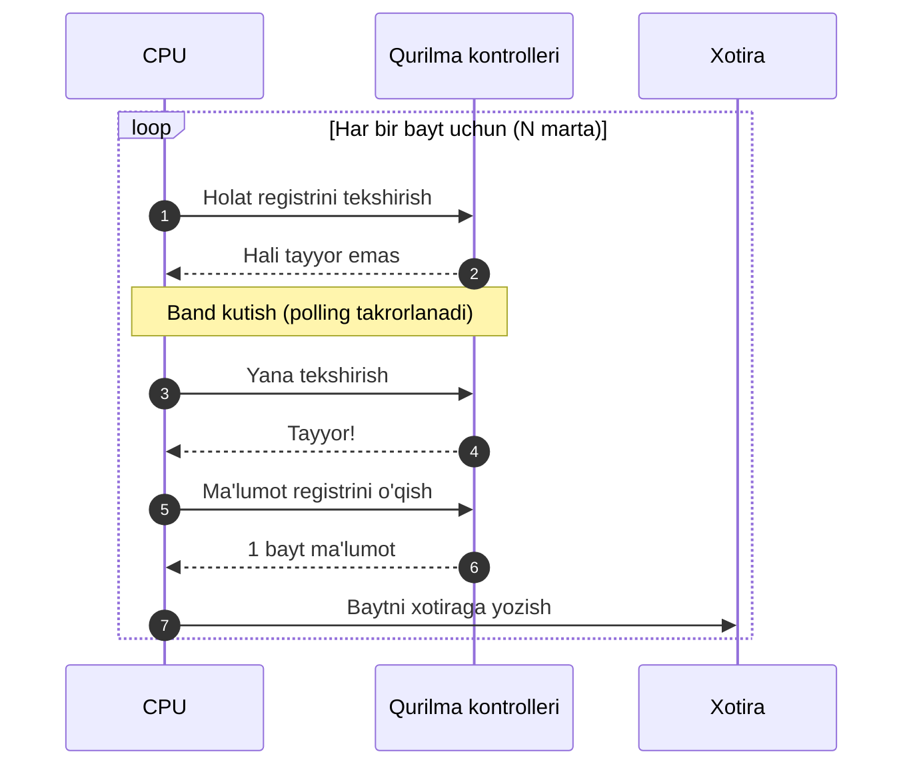
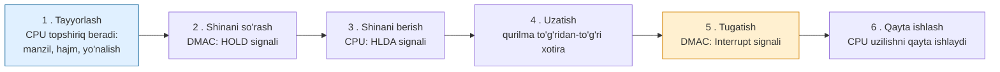
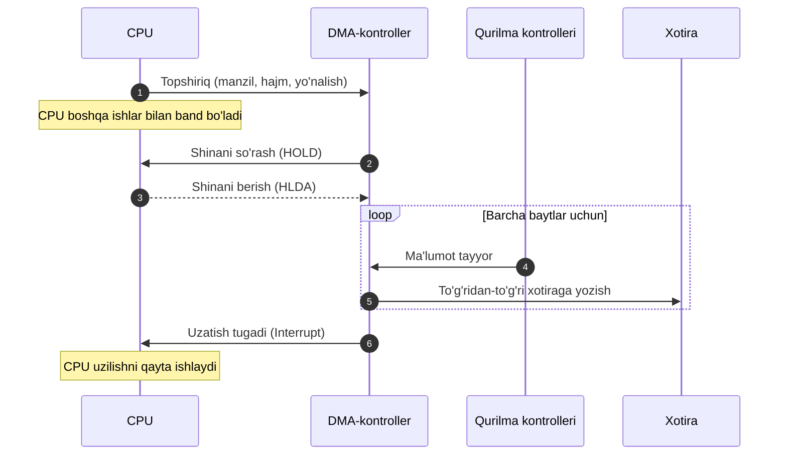
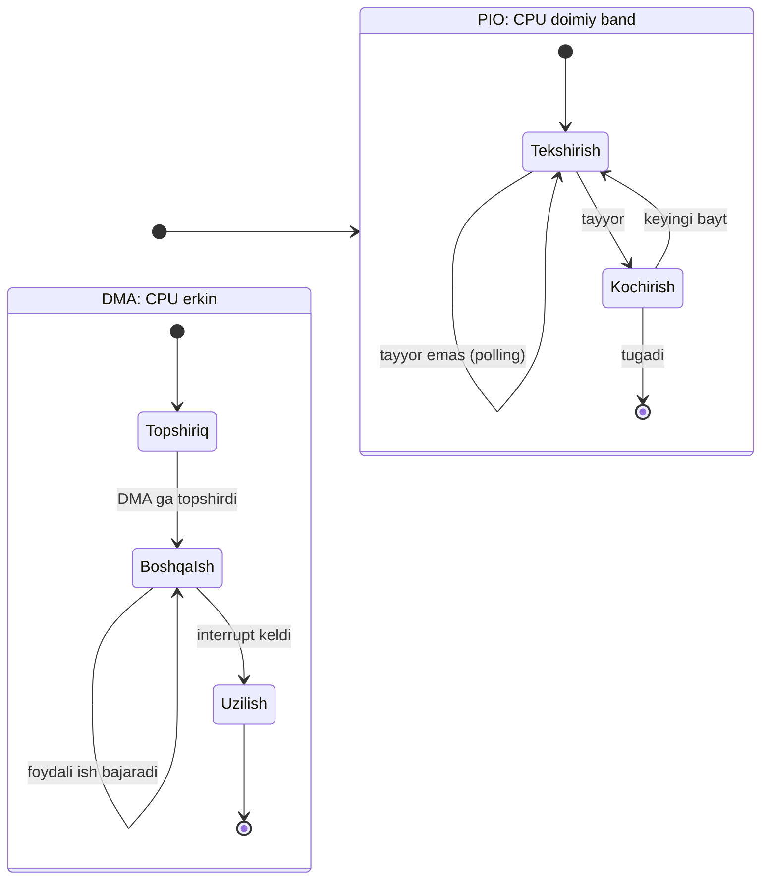

<div align="center">

# MUSTAQIL ISH

</div>

---

<div align="center">

**O'ZBEKISTON RESPUBLIKASI**
**OLIY TA'LIM, FAN VA INNOVATSIYALAR VAZIRLIGI**

<br>

**\_\_\_\_\_\_\_\_\_\_\_\_\_\_\_\_\_\_\_\_\_\_\_\_\_\_\_\_\_\_\_ UNIVERSITETI**

**\_\_\_\_\_\_\_\_\_\_\_\_\_\_\_\_\_\_\_\_\_\_\_\_\_\_\_ fakulteti**

<br><br>

## MUSTAQIL ISH

<br>

**Fan:** Operatsion tizimlar

**Mavzu:** PIO (Programmed I/O) va DMA (Direct Memory Access)
o'rtasidagi farqni modellashtirish
(diagrammalar va tavsif)

<br><br><br>

</div>

|  |  |
|---|---|
| **Bajardi:** | \_\_\_\_\_\_\_\_\_\_\_\_\_\_\_\_\_\_\_\_\_\_\_\_\_\_\_\_\_\_ |
| **Guruh:** | \_\_\_\_\_\_\_\_\_\_\_\_\_\_\_\_\_\_\_\_\_\_\_\_\_\_\_\_\_\_ |
| **Ilmiy rahbar:** | \_\_\_\_\_\_\_\_\_\_\_\_\_\_\_\_\_\_\_\_\_\_\_\_\_\_\_\_\_\_ |
| **Baho:** | \_\_\_\_\_\_\_\_\_\_\_\_\_\_\_\_\_\_\_\_\_\_\_\_\_\_\_\_\_\_ |

<br><br>

<div align="center">

**\_\_\_\_\_\_\_\_\_\_\_\_\_\_\_\_\_ — 2026-yil**

</div>

<div style="page-break-after: always;"></div>

## MUNDARIJA

| № | Bo'lim | Bet |
|:---:|:---|:---:|
| | **KIRISH** | 3 |
| **I** | **KIRISH-CHIQISH (I/O) TIZIMLARI HAQIDA UMUMIY TUSHUNCHA** | 4 |
| 1.1 | Kompyuterda ma'lumot almashinuvi va I/O qurilmalari | 4 |
| 1.2 | Qurilma kontrolleri va uning registrlari | 5 |
| 1.3 | Tezlik nomutanosibligi muammosi | 5 |
| 1.4 | Kirish-chiqishni boshqarish usullarining tasnifi | 6 |
| **II** | **PIO — DASTURIY BOSHQARILADIGAN KIRISH-CHIQISH** | 7 |
| 2.1 | PIO tushunchasi va ishlash prinsipi | 7 |
| 2.2 | Port-mapped va Memory-mapped I/O | 8 |
| 2.3 | Polling va "band kutish" mexanizmi | 8 |
| 2.4 | PIO ning diagrammasi va modeli | 9 |
| 2.5 | PIO ning afzallik va kamchiliklari | 10 |
| **III** | **DMA — TO'G'RIDAN-TO'G'RI XOTIRAGA KIRISH** | 11 |
| 3.1 | DMA tushunchasi va DMA-kontroller | 11 |
| 3.2 | DMA ning ishlash bosqichlari | 12 |
| 3.3 | DMA uzatish rejimlari | 13 |
| 3.4 | DMA ning diagrammasi va modeli | 14 |
| 3.5 | Zamonaviy DMA: bus mastering, scatter-gather, IOMMU | 15 |
| 3.6 | DMA ning afzallik va kamchiliklari | 16 |
| **IV** | **PIO VA DMA NI MODELLASHTIRISH VA TAQQOSLASH** | 17 |
| 4.1 | Ikki usulning qiyosiy modeli | 17 |
| 4.2 | To'liq taqqoslash jadvali | 18 |
| 4.3 | Unumdorlik tahlili (raqamli misol) | 18 |
| 4.4 | Qaysi holatda qaysi usul qo'llaniladi | 19 |
| | **XULOSA** | 20 |
| | **FOYDALANILGAN ADABIYOTLAR** | 20 |

<div style="page-break-after: always;"></div>

## KIRISH

Zamonaviy hisoblash texnikasining samaradorligi nafaqat markaziy protsessor (CPU) ning tezligiga, balki tashqi qurilmalar bilan ma'lumot almashinuvi qanchalik unumli tashkil etilganiga ham bog'liq. Qattiq disk, SSD, klaviatura, tarmoq adapteri, video karta va boshqa periferiya qurilmalari bilan protsessor o'rtasida doimiy ravishda katta hajmdagi ma'lumotlar oqimi harakatlanadi. Ushbu oqimni boshqarish — operatsion tizimlar va kompyuter arxitekturasining markaziy masalalaridan biridir.

Kirish-chiqish (*Input/Output*, I/O) amallarini tashkil etishning bir necha usuli mavjud bo'lib, ulardan eng ko'p o'rganiladigan ikkitasi — **PIO (Programmed Input/Output)** va **DMA (Direct Memory Access)** dir. Bu ikki usul ma'lumotni qurilmadan xotiraga (yoki aksincha) ko'chirishning printsipial jihatdan farqli yondashuvlarini ifodalaydi:

> **PIO** — har bir baytni bevosita protsessor ko'chiradi, ya'ni protsessor "ishchi" rolida bo'ladi.
>
> **DMA** — ma'lumotni maxsus apparat (DMA-kontroller) ko'chiradi, protsessor esa "boshqaruvchi" rolida bo'lib, bu vaqtda boshqa foydali ishlar bilan band bo'la oladi.

**Ishning maqsadi** — PIO va DMA usullarining ishlash prinsiplarini chuqur o'rganish, ular o'rtasidagi farqni diagrammalar va sxemalar yordamida modellashtirish hamda qiyosiy tahlil qilish.

**Ishning vazifalari:**

1. Kirish-chiqish tizimlarining umumiy tamoyillarini yoritish;
2. PIO usulining ishlash mexanizmini diagramma orqali tushuntirish;
3. DMA usulining ishlash bosqichlarini va kontroller rolini modellashtirish;
4. Ikki usulni qiyosiy jadval va sxemalar orqali taqqoslash;
5. Unumdorlik bo'yicha raqamli tahlil o'tkazish va amaliy tavsiyalar berish.

**Ishning dolzarbligi.** Zamonaviy SSD disklar, yuqori tezlikdagi tarmoqlar (10 GbE), GPU va NVMe qurilmalarida aynan DMA texnologiyasi keng qo'llaniladi. Shu bilan birga, PIO usuli ham oddiy mikrokontrollerlar va kam ma'lumotli amallarda hamon o'z ahamiyatini saqlab qolgan. Bu ikki usulni to'g'ri tushunish — samarali dasturiy ta'minot va apparat loyihalashning asosidir.

<div style="page-break-after: always;"></div>

## I BOB. KIRISH-CHIQISH (I/O) TIZIMLARI HAQIDA UMUMIY TUSHUNCHA

### 1.1. Kompyuterda ma'lumot almashinuvi va I/O qurilmalari

Kompyuter tizimi shartli ravishda uchta asosiy komponentdan tashkil topgan deb qaraladi:

- **Markaziy protsessor (CPU)** — buyruqlarni bajaradi va hisob-kitoblarni amalga oshiradi;
- **Asosiy xotira (RAM)** — bajarilayotgan dastur va ma'lumotlarni saqlaydi;
- **Kirish-chiqish qurilmalari (I/O devices)** — tashqi dunyo bilan aloqani ta'minlaydi.

Bu komponentlar **tizim shinasi (system bus)** orqali bog'langan. Shina uch qismdan iborat: **manzil shinasi** (address bus), **ma'lumot shinasi** (data bus) va **boshqaruv shinasi** (control bus).

```
        +-------------------+      Tizim shinasi (System Bus)      +-------------------+
        |       CPU         |<==================================>|    Xotira (RAM)   |
        +-------------------+   Manzil | Ma'lumot | Boshqaruv      +-------------------+
                                          ||
              +===========================++===========================+
              ||                          ||                          ||
              vv                          vv                          vv
       +---------------+         +-----------------+         +----------------------+
       | Disk          |         | Klaviatura      |         | Tarmoq adapteri      |
       | kontrolleri   |         | kontrolleri     |         | (NIC)                |
       +---------------+         +-----------------+         +----------------------+
              |                          |                          |
              v                          v                          v
        [Qattiq disk/SSD]          [Klaviatura]            [Tarmoq / Internet]
```

<div align="center"><em>1.1-rasm. Kompyuter tizimining umumiy tuzilmasi va I/O qurilmalari</em></div>

### 1.2. Qurilma kontrolleri va uning registrlari

Protsessor qurilma bilan to'g'ridan-to'g'ri emas, balki **qurilma kontrolleri (device controller)** orqali ishlaydi. Har bir kontrollerda quyidagi registrlar mavjud:

| Registr | Vazifasi |
|:---|:---|
| **Ma'lumot registri** (data register) | Uzatilayotgan baytni vaqtincha saqlaydi |
| **Holat registri** (status register) | Qurilma holatini ko'rsatadi: band, tayyor, xato |
| **Boshqaruv registri** (control register) | Qurilmaga buyruq beradi (o'qish/yozish/start) |

<div align="center"><em>1.1-jadval. Qurilma kontrollerining asosiy registrlari</em></div>

### 1.3. Tezlik nomutanosibligi muammosi

I/O qurilmalari protsessorga nisbatan ancha sekin ishlaydi. Protsessor buyruqni nanosaniyalarda bajaradi, qattiq disk esa millisaniyalar talab qiladi — bu farq million martagacha yetishi mumkin. Bu **tezlik nomutanosibligi (speed mismatch)** muammosini keltirib chiqaradi va aynan shu muammo turli I/O usullarining paydo bo'lishiga sabab bo'lgan.

### 1.4. Kirish-chiqishni boshqarish usullarining tasnifi

I/O ni boshqarishning uchta asosiy usuli mavjud:



<div align="center"><em>1.2-rasm. I/O boshqaruv usullarining tasnifi</em></div>

Bu uch usul orasidagi farq — **protsessor ma'lumot uzatishda qanchalik ishtirok etishi** bilan belgilanadi. PIO da CPU 100% band, interrupt-driven I/O da qisman bo'sh, DMA da esa deyarli erkin bo'ladi. Ushbu ishda asosiy e'tibor **PIO** va **DMA** — bir-biriga eng qarama-qarshi ikki usulga qaratiladi.

<div style="page-break-after: always;"></div>

## II BOB. PIO — DASTURIY BOSHQARILADIGAN KIRISH-CHIQISH

### 2.1. PIO tushunchasi va ishlash prinsipi

**Programmed I/O (PIO)** — ma'lumotni qurilma va xotira o'rtasida ko'chirishning eng oddiy usuli bo'lib, unda **butun jarayonni markaziy protsessor o'zi bajaradi**. Har bir bayt yoki so'z protsessor registri orqali o'tadi: avval qurilmadan CPU registriga, so'ngra registrdan xotiraga (yoki teskari yo'nalishda).

PIO da ma'lumot uzatishning umumiy ketma-ketligi:

1. CPU qurilmaning **holat registrini** o'qiydi;
2. Agar qurilma **tayyor emas** bo'lsa, CPU qayta-qayta tekshiradi (polling);
3. Qurilma **tayyor** bo'lganda, CPU bir bayt ma'lumotni o'qiydi/yozadi;
4. CPU ma'lumotni xotiraga ko'chiradi;
5. Hisoblagichni kamaytirib, keyingi baytga o'tadi;
6. Barcha baytlar uzatilguncha jarayon takrorlanadi.

### 2.2. Port-mapped va Memory-mapped I/O

PIO ikki xil usulda amalga oshirilishi mumkin:

| Usul | Tavsif | Misol |
|:---|:---|:---|
| **Port-mapped I/O** (PMIO) | Qurilma registrlari alohida I/O manzil fazosida bo'ladi, maxsus buyruqlar ishlatiladi | x86 dagi `IN` va `OUT` buyruqlari |
| **Memory-mapped I/O** (MMIO) | Qurilma registrlari oddiy xotira manzillariga joylashtiriladi | Oddiy `LOAD`/`STORE` buyruqlari (ARM, RISC-V) |

<div align="center"><em>2.1-jadval. PIO ni amalga oshirishning ikki usuli</em></div>

### 2.3. Polling va "band kutish" mexanizmi

PIO ning eng muhim xususiyati — **polling (so'rov)** mexanizmidir. Protsessor qurilma tayyorligini bilish uchun holat registrini doimiy aylanma (loop) ichida tekshiradi. Bu jarayon **"band kutish" (busy waiting)** deb ataladi, chunki protsessor foydali ish qilmasdan faqat kutib turadi.

```c
// PIO orqali N bayt o'qish (C-ga o'xshash psevdokod)
for (int i = 0; i < N; i++) {
    // 1-bosqich: qurilma tayyor bo'lguncha kutish (BUSY WAITING)
    while ((status_register & READY_BIT) == 0) {
        ;   // hech narsa qilmasdan tekshiraveramiz — CPU vaqti behuda ketadi
    }
    // 2-bosqich: ma'lumotni qurilmadan o'qish
    char data = read_port(DATA_REGISTER);
    // 3-bosqich: ma'lumotni xotiraga yozish
    buffer[i] = data;
}
```

<div align="center"><em>2.1-listing. PIO orqali ma'lumot o'qish algoritmi (busy waiting bilan)</em></div>

Bu yerda `while` aylanmasi — aynan o'sha "band kutish" bo'lib, protsessor vaqtini eng ko'p sarflaydigan qismdir.

### 2.4. PIO ning diagrammasi va modeli

PIO da ma'lumotning harakat yo'li **qurilma → CPU → xotira** ko'rinishida bo'ladi: har bir bayt majburan protsessor orqali o'tadi.

```
        +-------------------------------------------------+
        |                      CPU                        |
        |    +-----------+        +------------------+    |
        |    | Registr   |<------>| Boshqaruv mantiq |    |
        |    +-----------+        +------------------+    |
        +-------^------------------------+----------------+
                |                        |
       (1) O'QISH|                       |(2) YOZISH
                |                        v
        +----------------+       +----------------+
        | Qurilma        |       | Xotira (RAM)   |
        | kontrolleri    |       |                |
        +----------------+       +----------------+
                ^
                |
          [Tashqi qurilma]

   MA'LUMOT YO'LI:  QURILMA --> CPU REGISTRI --> XOTIRA
   (har bir bayt majburan CPU orqali o'tadi)
```

<div align="center"><em>2.2-rasm. PIO da ma'lumotning harakat yo'li</em></div>

Quyidagi ketma-ketlik diagrammasi PIO jarayonini vaqt bo'yicha ko'rsatadi:



<div align="center"><em>2.3-rasm. PIO jarayonining ketma-ketlik diagrammasi</em></div>

### 2.5. PIO ning afzallik va kamchiliklari

<table>
<tr><th>✅ Afzalliklari</th><th>❌ Kamchiliklari</th></tr>
<tr><td>

- **Soddaligi** — qo'shimcha apparat talab qilmaydi
- **Arzonligi** — minimal apparat xarajati
- **Kichik ma'lumot uchun samarali** — overhead yo'q
- **To'liq nazorat** — sinxronlash oson

</td><td>

- **CPU vaqtini behuda sarflash** — busy waiting
- **Past unumdorlik** — katta ma'lumotda sekin
- **Tizim samaradorligi pasayadi** — CPU bloklanadi
- **Energiya isrofi** — CPU doimiy band

</td></tr>
</table>

<div align="center"><em>2.2-jadval. PIO ning afzallik va kamchiliklari</em></div>

<div style="page-break-after: always;"></div>

## III BOB. DMA — TO'G'RIDAN-TO'G'RI XOTIRAGA KIRISH

### 3.1. DMA tushunchasi va DMA-kontroller

**Direct Memory Access (DMA)** — ma'lumotni qurilma va asosiy xotira o'rtasida **protsessorni chetlab o'tib**, to'g'ridan-to'g'ri ko'chirish texnologiyasidir. Bu vazifani maxsus apparat — **DMA-kontroller (DMAC)** bajaradi.

DMA-kontroller protsessor o'rniga shinani boshqarib, ma'lumotni mustaqil uzatadi. Protsessor faqat **boshlanishida** topshiriq beradi va **tugaganida** uzilish (interrupt) signali oladi.

**DMA-kontrollerning asosiy registrlari:**

| Registr | Vazifasi |
|:---|:---|
| **Manzil registri** (address register) | Xotiradagi boshlang'ich manzil |
| **Hisoblagich registri** (count register) | Uzatiladigan baytlar soni |
| **Boshqaruv registri** (control register) | Yo'nalish (o'qish/yozish) va rejim |
| **Holat registri** (status register) | Uzatish holati |

<div align="center"><em>3.1-jadval. DMA-kontrollerning registrlari</em></div>

### 3.2. DMA ning ishlash bosqichlari



<div align="center"><em>3.1-rasm. DMA ning ishlash bosqichlari</em></div>

1. **Tayyorlash (initialization):** CPU DMA-kontrollerga xotira manzili, baytlar soni va uzatish yo'nalishini beradi;
2. **Shinani so'rash (bus request):** DMAC protsessordan shinadan foydalanish huquqini so'raydi (**HOLD** signali);
3. **Shinani berish (bus grant):** CPU shinani DMAC ga beradi (**HLDA** signali);
4. **Ma'lumot uzatish (transfer):** DMAC ma'lumotni qurilma va xotira o'rtasida to'g'ridan-to'g'ri ko'chiradi;
5. **Tugatish (completion):** barcha baytlar uzatilgach, DMAC protsessorga **uzilish (interrupt)** signalini yuboradi;
6. **Qayta ishlash:** CPU uzilishni qayta ishlaydi va natijani tekshiradi.

### 3.3. DMA uzatish rejimlari

| Rejim | Tavsif | Xususiyati |
|:---|:---|:---|
| **Burst mode** (paket) | Butun blok bir yo'la uzatiladi, shina to'liq band qilinadi | Eng tez, lekin CPU uzoq bloklanadi |
| **Cycle stealing** (sikl o'g'irlash) | Bitta siklda bitta bayt uzatiladi, so'ng shina CPU ga qaytadi | CPU va DMA navbatma-navbat ishlaydi |
| **Transparent mode** (shaffof) | DMA faqat CPU shinani ishlatmaganda uzatadi | CPU ga halal bermaydi, lekin sekin |

<div align="center"><em>3.2-jadval. DMA uzatish rejimlari</em></div>

### 3.4. DMA ning diagrammasi va modeli

DMA da ma'lumotning harakat yo'li **qurilma ↔ xotira** ko'rinishida bo'lib, protsessor bu yo'lda ishtirok etmaydi:

```
        +-------------------+
        |       CPU         |  <-- boshqa vazifalar bilan band
        +---------^---------+
                  |  ^
       (1)topshiriq| |(5) uzilish (interrupt)
                  v  |
        +-------------------+        Ma'lumot to'g'ridan-to'g'ri
        |  DMA-KONTROLLER   |        QURILMA <==> XOTIRA
        +---------+---------+        (CPU chetlab o'tiladi)
                  |
        +---------+----------+
        |                    |
        v                    v
+----------------+   +----------------+
| Qurilma        |==>| Xotira (RAM)   |
| kontrolleri    |<==|                |
+----------------+   +----------------+
        ^
        |
   [Tashqi qurilma]
```

<div align="center"><em>3.2-rasm. DMA da ma'lumotning harakat yo'li</em></div>



<div align="center"><em>3.3-rasm. DMA jarayonining ketma-ketlik diagrammasi</em></div>

### 3.5. Zamonaviy DMA: bus mastering, scatter-gather, IOMMU

Tarixiy jihatdan DMA-kontroller markaziy chip (masalan, Intel 8237) edi. Zamonaviy tizimlarda esa **bus mastering DMA** qo'llaniladi — qurilmaning o'zi (SSD, tarmoq adapteri, GPU) shina ustasi bo'lib, xotiraga mustaqil murojaat qiladi. Quyidagi muhim tushunchalarni ajratib ko'rsatish lozim:

- **Scatter-gather DMA** — ma'lumotni xotiraning bir nechta uzilgan (tutash bo'lmagan) bloklariga bir amalda taqsimlash imkonini beradi. Bu virtual xotira tizimlarida juda muhim.
- **Cache coherency (kesh muvofiqligi)** — DMA xotirani to'g'ridan-to'g'ri o'zgartirganda, CPU keshidagi nusxa eskirib qolishi mumkin. Buni *bus snooping* yoki dasturiy kesh tozalash (flush/invalidate) hal qiladi.
- **IOMMU** (I/O Memory Management Unit) — DMA murojaatlari uchun virtual-fizik manzil tarjimasi va himoyani ta'minlaydi; qurilma faqat ruxsat etilgan xotira sohasiga kira oladi (xavfsizlik).

### 3.6. DMA ning afzallik va kamchiliklari

<table>
<tr><th>✅ Afzalliklari</th><th>❌ Kamchiliklari</th></tr>
<tr><td>

- **CPU ni bo'shatadi** — parallel ishlash mumkin
- **Yuqori unumdorlik** — katta ma'lumot tez uzatiladi
- **Bitta uzilish** — faqat oxirida (har baytda emas)
- **Energiya tejamkorligi** — CPU band kutmaydi

</td><td>

- **Apparat murakkabligi** — qo'shimcha kontroller
- **Narxi yuqoriroq**
- **Shina ziddiyati** — bus contention
- **Kesh muvofiqligi muammosi**
- **Kichik ma'lumot uchun overhead katta**

</td></tr>
</table>

<div align="center"><em>3.3-jadval. DMA ning afzallik va kamchiliklari</em></div>

<div style="page-break-after: always;"></div>

## IV BOB. PIO VA DMA NI MODELLASHTIRISH VA TAQQOSLASH

### 4.1. Ikki usulning qiyosiy modeli

PIO va DMA o'rtasidagi tub farq — **ma'lumotning harakat yo'li** va **protsessorning roli**dadir.

```
========================= PIO (Programmed I/O) =========================

   [Qurilma] ---> [ CPU REGISTRI ] ---> [ Xotira ]
                      (har bir bayt)
   CPU holati:  BAND  (band kutish + ko'chirish)
   Vaqt o'qi:   |##CPU##|##CPU##|##CPU##|##CPU##|##CPU##|   (100% band)


====================== DMA (Direct Memory Access) ======================

   [Qurilma] <=============================> [ Xotira ]
                 (DMA-kontroller orqali)
              CPU bu yo'lda ishtirok etmaydi
   CPU holati:  ERKIN  (boshqa vazifalarni bajaradi)
   Vaqt o'qi:   |topshiriq|....CPU boshqa ish bajaradi....|uzilish|
                          (DMA mustaqil uzatadi)
```

<div align="center"><em>4.1-rasm. PIO va DMA da ma'lumot yo'li va CPU holatining qiyosi</em></div>



<div align="center"><em>4.2-rasm. CPU holatlari: PIO da doimiy band, DMA da erkin</em></div>

### 4.2. To'liq taqqoslash jadvali

| № | Mezon | PIO (Programmed I/O) | DMA (Direct Memory Access) |
|:---:|:---|:---|:---|
| 1 | **Ma'lumot yo'li** | Qurilma → CPU → Xotira | Qurilma ↔ Xotira (to'g'ridan-to'g'ri) |
| 2 | **CPU roli** | Har bir baytni o'zi ko'chiradi | Faqat boshlaydi va tugashini kutadi |
| 3 | **CPU bandligi** | To'liq band (busy waiting) | Deyarli erkin |
| 4 | **Qo'shimcha apparat** | Kerak emas | DMA-kontroller kerak |
| 5 | **Tezlik** | Sekin | Tez |
| 6 | **Apparat narxi** | Arzon | Qimmatroq |
| 7 | **Murakkablik** | Oddiy | Murakkab |
| 8 | **Katta ma'lumot** | Samarasiz | Juda samarali |
| 9 | **Kichik ma'lumot** | Samarali | Overhead katta |
| 10 | **Uzilish soni** | Yo'q yoki har baytda | Faqat oxirida (1 marta) |
| 11 | **Energiya sarfi** | Yuqori | Past |
| 12 | **Parallel ishlash** | Yo'q | Bor (CPU + DMA) |
| 13 | **Misol qurilmalar** | Klaviatura, sichqoncha, sensor | SSD, disk, tarmoq, GPU, audio |

<div align="center"><em>4.4-jadval. PIO va DMA ning to'liq qiyosiy tahlili</em></div>

### 4.3. Unumdorlik tahlili (raqamli misol)

Faraz qilaylik, **4 KB (4096 bayt)** ma'lumotni diskdan xotiraga ko'chirmoqchimiz.

**PIO holatida:**
- Har bir bayt uchun CPU ~3–4 amal bajaradi (tekshirish + o'qish + yozish);
- 4096 × 4 ≈ **16 384 ta CPU amali**;
- Bu vaqt davomida CPU **boshqa hech narsa qila olmaydi**.

**DMA holatida:**
- CPU faqat 1 marta topshiriq beradi (~5–10 amal);
- DMAC 4096 baytni mustaqil ko'chiradi;
- CPU bu vaqtda **~16 000 amalni boshqa vazifalarga** sarflashi mumkin;
- Oxirida 1 ta uzilish qayta ishlanadi.

```
Unumdorlik qiyosi (4 KB uzatish):

PIO:  CPU yuki  ######################################  ~100% band
      Foydali ish (boshqa vazifa):  (yo'q)

DMA:  CPU yuki  ###                                     ~5% band
      Foydali ish (boshqa vazifa):  #################################  ~95%
```

<div align="center"><em>4.3-rasm. 4 KB ma'lumot uzatishda CPU yukining qiyosi</em></div>

**Xulosa:** ma'lumot hajmi qancha katta bo'lsa, DMA ning afzalligi shuncha sezilarli. Kichik (1–2 bayt) ma'lumotlarda esa PIO afzalroq, chunki DMA ni sozlash uchun ketadigan vaqt (overhead) uzatishning o'zidan ko'proq bo'lib qoladi.

### 4.4. Qaysi holatda qaysi usul qo'llaniladi

<table>
<tr><th>PIO afzal bo'lgan holatlar</th><th>DMA afzal bo'lgan holatlar</th></tr>
<tr><td>

- Kam ma'lumotli qurilmalar (klaviatura, sichqoncha)
- Oddiy mikrokontroller va embedded tizimlar
- DMA-kontroller yo'q arzon tizimlar
- Yuklash (boot) jarayonining dastlabki bosqichi

</td><td>

- Katta hajmli ma'lumot (disk, SSD, NVMe)
- Yuqori tezlikli tarmoq (Ethernet, Wi-Fi)
- Grafik kartalar (GPU), video oqim
- Audio (uzluksiz oqim), real vaqt tizimlari

</td></tr>
</table>

<div align="center"><em>4.5-jadval. PIO va DMA ning qo'llanilish sohalari</em></div>

<div style="page-break-after: always;"></div>

## XULOSA

Ushbu mustaqil ishda kompyuter tizimlarida kirish-chiqish amallarini boshqarishning ikki muhim usuli — **PIO (Programmed I/O)** va **DMA (Direct Memory Access)** batafsil o'rganildi, diagrammalar va sxemalar yordamida modellashtirildi hamda qiyosiy tahlil qilindi.

Ish davomida quyidagi asosiy **xulosalar** olindi:

1. **PIO usulida** ma'lumotning har bir bayti majburan markaziy protsessor orqali o'tadi. Bu protsessorni "band kutish" (busy waiting) holatiga olib keladi va uning vaqtini behuda sarflaydi. PIO sodda va arzon, ammo katta hajmli ma'lumotlar uchun samarasizdir.

2. **DMA usulida** ma'lumot maxsus DMA-kontroller yordamida qurilma va xotira o'rtasida to'g'ridan-to'g'ri, protsessorni chetlab ko'chiriladi. Protsessor faqat jarayonni boshlaydi va tugaganida uzilish signalini oladi. Bu yuqori unumdorlik va parallel ishlashni ta'minlaydi.

3. **Asosiy farq** — PIO da CPU "ishchi" rolida (har baytni o'zi ko'chiradi), DMA da esa "boshqaruvchi" rolida (faqat topshiradi va natijani oladi) bo'ladi. PIO da ma'lumot yo'li uch bosqichli (qurilma → CPU → xotira), DMA da esa to'g'ridan-to'g'ri (qurilma ↔ xotira).

4. **Tanlov mezoni** — kichik va kam sonli ma'lumotlar uchun PIO, katta hajmli va tezkor ma'lumotlar uchun esa DMA afzaldir. Zamonaviy tizimlarda (SSD, GPU, NVMe, tezkor tarmoqlar) aynan DMA — bus mastering, scatter-gather va IOMMU kabi texnologiyalar bilan birga — ustunlik qiladi.

Demak, PIO va DMA bir-birini inkor etmaydigan, balki turli vaziyatlarda bir-birini to'ldiruvchi usullardir. Samarali kompyuter tizimini loyihalashda har bir usulning kuchli va kuchsiz tomonlarini hisobga olgan holda to'g'ri tanlov qilish muhimdir. Diagrammalar orqali modellashtirish esa bu ikki usulning tub farqini aniq va tushunarli ko'rsatib berdi.

---

## FOYDALANILGAN ADABIYOTLAR

1. Silberschatz A., Galvin P. B., Gagne G. *Operating System Concepts.* 10th Edition. — Wiley, 2018.
2. Tanenbaum A. S., Bos H. *Modern Operating Systems.* 4th Edition. — Pearson, 2015.
3. Stallings W. *Operating Systems: Internals and Design Principles.* 9th Edition. — Pearson, 2018.
4. Patterson D. A., Hennessy J. L. *Computer Organization and Design.* 5th Edition. — Morgan Kaufmann, 2014.
5. Hamacher C., Vranesic Z., Zaky S. *Computer Organization and Embedded Systems.* 6th Edition. — McGraw-Hill, 2012.
6. Null L., Lobur J. *The Essentials of Computer Organization and Architecture.* 5th Edition. — Jones & Bartlett Learning, 2018.
7. Mano M. M. *Computer System Architecture.* 3rd Edition. — Pearson, 2007.

---

<div align="center"><em>Mustaqil ish · Fan: Operatsion tizimlar · Mavzu: PIO va DMA · 2026-yil</em></div>
